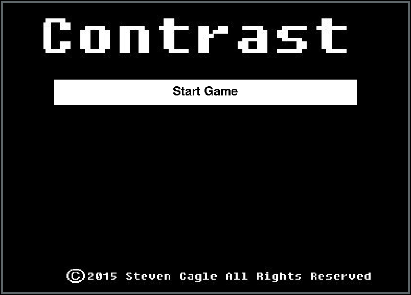

# Contrast
A Java game made for my high school IB Computer Science HL Final Project (Fall 2014 - Spring 2015)
* Made with Eclipse IDE

## Pictures



## Concept: 
"In a land void of color and diversity, only a brave few will choose to be different."

In this game you must first recruit your characters (Warriors and Archers), specialize them to your liking, and battle them 
in the arena against your AI enemies. 

Essentially the more colorful your players are, the better they are (0-255, 0-255, 0-255)
* More Red   = more Strength
* More Green = more Health
* More Blue  = more Speed

This is my basic proof of concept introduction to java game development.
Inspired by "The King's League" games developed by kurechii ( http://armorgames.com/user/kurechii )

## How to run
* cd into `bin` 
```java
java main/Contrast
```
